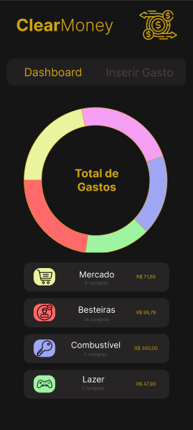

# Título do Projeto: ClearMoney
  

Projeto: ClearMoney - Controle de Gastos Pessoais
Instituição: Instituto Federal de Educação, Ciência e Tecnologia de Brasília (IFB)
Curso: Sistemas para Internet
Tecnologias: Dart, Flutter e Firebase(BaaS)

## Descrição 
Aplicativo multiplataforma (Android, iOS e Web) focado no controle financeiro pessoal, permitindo o rastreamento de gastos mensais por categorias e a visualização de dashboards intuitivos.
---
### Mapeamento de Usuários
Nesta seção, identificamos quem interagirá com o sistema:
- Usuário Comum (Cidadão/Estudante): Pessoa física que utiliza o aplicativo para registrar suas receitas e despesas diárias, criar categorias de gastos e acompanhar o impacto financeiro no seu mês através de painéis gráficos.
- Administrador do Sistema (Opcional para o futuro): Responsável por gerenciar categorias globais padrão, manter a segurança da plataforma e analisar métricas anonimizadas de uso.
---
### Requisitos Técnicos
Conforme as bases tecnológicas definidas para o projeto:
- Frontend: Interface responsiva e fluida construída com Dart e Flutter, garantindo compilação nativa para Android, iOS e adaptação para Web.
- Backend & Banco de Dados: Utilização da plataforma Firebase (BaaS) para autenticação e persistência de dados em tempo real utilizando o Cloud Firestore.
- Validação: Implementação de regras no frontend para impedir registros inconsistentes (como valores nulos) e no backend através de Firestore Rules.
---
### Backlog Inicial
Uma lista priorizada de funcionalidades para guiar o desenvolvimento incremental:
1.  Autenticação de Usuário: Login para manter a privacidade dos dados.
2.  Painel de Dashboard: Visualização gráfica (Gráfico de Pizza) sumarizando o total de gastos do mês
3.  Listagem Hierárquica: Exibição em cascata das categorias e suas respectivas subcategorias de gastos.
4.  Registro de Transações: Formulário dinâmico para entrada de despesas, vinculadas a datas, valores numéricos e classificação.
---
### Protótipos de Integração(Wireframes)
Print tirado da tela do Figma:

 

---
### Estrutura de Banco de Dados

O armazenamento segue o padrão NoSQL orientado a documentos, estruturado para garantir a privacidade dos dados.
*   Coleção Principal (`usuarios`):
    *   Caminho: `usuarios/{uid}`
    *   Dados: `nome`, `email`, `dataCriacao`.
*   **Subcoleção (`transacoes`):**
    *   Caminho: `usuarios/{uid}/transacoes/{transacaoId}`
    *   Dados: `valor` (Double), `data` (Timestamp), `categoria` (String), `subcategoria` (String), `descricao` (String).
---
### Documentação de Fluxo e Regras de Segurança (Firestore Rules)
Como não há um servidor backend intermediário, a validação de regras de negócio será feita através das Regras de Segurança do Firebase:  
- Autenticação Obrigatória: O usuário só pode ler, criar, editar ou excluir documentos que estejam dentro do seu próprio `uid`.
- Validação de Dados: As regras garantirão que o campo `valor`  seja um número positivo e que o campo `tipo` aceite apenas "RECEITA" ou "DESPESA".
- Comunicação: O Frontend em Flutter utilizará os pacotes oficiais `firebase_core`, `firebase_auth`  e `cloud_firestore` para realizar o CRUD diretamente no banco.
---
### Modelagem e Casos de Uso
**Modelagem de Requisitos Detalhada:**  
- RF01 - Registrar Transação: O sistema deve persistir a despesa ou receita como um documento no Firestore, vinculado ao UID do usuário autenticado.
- RNF01 - Persistência em Tempo Real: A aplicação deve utilizar a capacidade real-time do Firestore para que, ao adicionar uma despesa, o dashboard seja recalculado e atualizado na interface sem necessidade de recarregar a tela.

**Casos de Uso Técnicos**  
Caso de Uso: UC01 - Registrar Gasto Mensal
- Ator: Usuário Comum.  
- Pré-condição: Usuário autenticado via Firebase Auth.  
- Fluxo Principal:  
   1. O usuário preenche os dados da transação no Flutter.
   2. O frontend valida os campos obrigatórios localmente.
   3. O aplicativo chama o método `.add()`  da coleção `transacoes`  no Firestore.
   4. As Firestore Rules validam a operação na nuvem.
   5. O documento é criado com sucesso.
   6. O StreamBuilder do Flutter detecta a mudança e atualiza o gráfico no dashboard automaticamente.
---
### Arquitetura
O sistema seguirá uma arquitetura **baseada em BaaS (Backend as a Service)**, utilizando serviços gerenciados em nuvem para descentralizar a lógica do servidor tradicional.

- Padrão Arquitetural no Frontend: Utilizaremos uma arquitetura baseada em Features (Módulos) ou Clean Architecture adaptada para o Flutter, separando claramente a Interface de Usuário (UI), a Gerência de Estado e a Camada de Dados (Integração com Firebase).
---
### Stack Tecnológica
- Frontend: Desenvolvido em Dart com o framework Flutter, garantindo a criação de uma interface responsiva, com compilação nativa para Android, iOS e Web a partir de um único código-fonte.
- Backend / BaaS: Utilização da plataforma Firebase.
  - Autenticação: Firebase Authentication (Login por e-mail/senha e Google).
  - Persistência de Dados: Cloud Firestore (Banco de dados NoSQL orientado a documentos).
- Gerenciamento de Estado: (Sugestão: `Provider`, `Riverpod` ou `BLoC`) para gerenciar a reatividade do aplicativo quando os dados financeiros forem atualizados.
---
### Organização do Repositório
O repositório do aplicativo será organizado para facilitar a manutenção e escalabilidade do código fonte. O diretório principal `/lib`  do Flutter seguirá a seguinte divisão:
- `/lib/models`: Classes de dados que representam as entidades (ex: `transacao_model.dart`, `categoria_model.dart`).
- `/lib/screens`: Telas e componentes visuais de interface do usuário (ex: `dashboard_screen.dart`).
- `/lib/services`: Classes responsáveis por comunicar com o Firebase (ex: `firestore_service.dart`).
- `/lib/utils`: Funções auxiliares, como formatação de moeda (R$) e datas.
- `/docs`: Documentação técnica do projeto, incluindo este README e os protótipos de tela.
---
### Estratégia de Persistência e Integração
- Camada de Dados: Uso de pacotes oficiais (SDKs) do Firebase para Dart (`cloud_firestore`) para realizar a comunicação direta e segura com o banco NoSQL. Não haverá a necessidade de um ORM tradicional, pois os dados serão convertidos de/para JSON diretamente através de métodos como `fromJson`  e `toJson`  nos modelos.
- Variáveis de Ambiente: O projeto usará o arquivo `.env` para gerenciar chaves de API e configurações de ambiente, garantindo que credenciais sensíveis não fiquem expostas no código público.
---
### Defesa de Decisões Técnicas
- Por que Flutter e Dart? A escolha de um framework híbrido de alta performance elimina a necessidade de criar três projetos separados (um para web, um para Android e outro para iOS). Isso permite construir e distribuir a aplicação de forma rápida e otimizada.
- Por que Firebase (Firestore)? A adoção de um banco NoSQL em tempo real justifica-se pela necessidade de refletir instantaneamente as transações financeiras nos dashboards do usuário. Além disso, essa stack reduz os custos com infraestrutura inicial, permitindo o desenvolvimento de tecnologias que realmente façam a diferença na sociedade, com foco total no impacto e acessibilidade, sem depender de arquiteturas comerciais complexas e custosas logo na primeira versão do sistema.
---
### Modelagem e Casos de Uso

**Modelagem de Dados NoSQL(Cloud Firestore)**

Como a aplicação utiliza o Firebase, a modelagem de dados não segue o padrão relacional tradicional com chaves estrangeiras complexas, mas sim uma estrutura hierárquica baseada em Coleções e Documentos para otimizar as leituras em tempo real.

Coleção `usuarios`:
- Documento ID: UID gerado pelo Firebase Authentication.
- Campos: `nome` (String), `email` (String), `data_criacao` (Timestamp).

Subcoleção `transacoes` (Aninhada em `usuarios/{uid}`):
- Documento ID: Auto-gerado pelo Firestore.
- Campos:
    - `valor` (Number / Double)
    - `data` (Timestamp)
    - `categoria` (String)
    - `subcategoria` (String)
    - `descricao` (String / Opcional)
---
### Casos de Uso Técnico
- Caso de Uso: UC02 - Cadastro e Validação de Despesa
    - Ator: Usuário Comum.
    - Pré-condição: Usuário deve estar autenticado.
    - Fluxo Principal:
      1. O usuário acessa a aba "Inserir Gasto".
      2. O frontend apresenta o formulário validado (`GlobalKey<FormState>`).
      3. Ao selecionar uma Categoria macro, o sistema filtra dinamicamente o Dropdown de Subcategorias.
      4. O usuário preenche o valor numérico e seleciona a data no calendário nativo.
      5. O aplicativo submete os dados para a subcoleção do usuário no Firestore.
      6. O listener do Firestore atualiza o painel principal automaticamente.
---
### Implementação do Backend (Firebase as a Service)
Substituindo a necessidade de um servidor próprio em Java ou Node.js, o projeto delega as responsabilidades de backend para o ecossistema Firebase.

**Regras de Negócio e Segurança(Firestore Rules)**
As validações que tradicionalmente ocorreriam em uma camada Service ou em DTOs são garantidas diretamente pelas Regras de Segurança do banco na nuvem:
- Isolamento de Dados: Um usuário só possui permissão de leitura (`read`) e escrita (`write`) nos documentos onde a rota coincide com o seu próprio UID de autenticação (`request.auth.uid == userId`).
- Integridade de Tipos: Validação de que o campo valor inserido seja obrigatoriamente um número positivo, evitando que injeções de dados maliciosas quebrem os cálculos do dashboard.
---
### Implementação do Frontend
A interface foi construída seguindo o padrão de separação por módulos (features), consumindo as capacidades do framework Flutter para garantir reatividade e alta performance na compilação multiplataforma.
1. Estrutura de Interface(UI):
  - Navegação: Implementada utilizando `DefaultTabController`  e `TabBarView`, permitindo uma transição fluida e sem recarregamentos entre o Dashboard e o Formulário.
  - Gerenciamento de Estado Local: A tela de formulário utiliza `StatefulWidget`  para reconstruir apenas os componentes necessários (como o filtro de subcategorias) de forma independente.
2. Componentes Visuais e Bibliotecas:
  - fl_chart: Biblioteca adotada para a renderização do gráfico de pizza (`Pie Chart`). Os dados das transações são convertidos em PieChartSectionData, alocando tamanhos proporcionais baseados na soma dos gastos e sobrepondo os ícones representativos
  - ExpansionTile: Utilizado na listagem de categorias macro para ocultar/revelar as subcategorias em formato de cascata. Essa abordagem limpa a poluição visual do dashboard e melhora a Experiência do Usuário (UX).
3. Validação de Dados no Frontend:
  - Assim como as boas práticas de consumo de API exigem validação prévia antes do envio, o aplicativo implementa validadores nos campos `TextFormField`  e `DropdownButtonFormField`. Mensagens de erro são disparadas se o usuário tentar registrar uma despesa com campos obrigatórios em branco, reduzindo o tráfego desnecessário de requisições malformadas para o banco de dados.